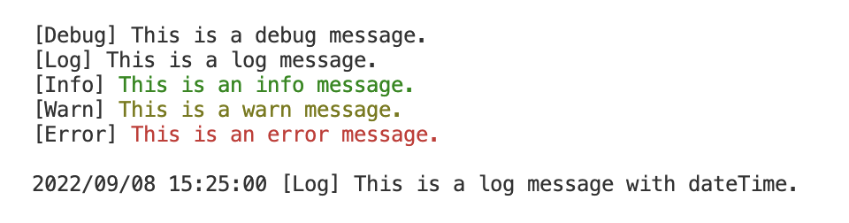

# color-logger

The logger that can output with colors.

## Example



## Install

npm

```
npm install @xcreatormasa/color-logger
```

yarn

```
yarn add @xcreatormasa/color-logger
```

## Usage

CommonJS

```
const logger = require('@xcreatormasa/color-logger')

logger.info('This is an info message.')
```

ES Module

```
import logger from '@xcreatormasa/color-logger'

logger.info('This is an info message.')
```

logger has 5 methods: debug(), log(), info(), warn(), error().

## Config

You can configure output by setting logger.config.

```
type LogColor = 'black' | 'red' | 'green' | 'yellow' | 'blue' | 'magenta' | 'cyan' | 'white'

type LoggerConfig = {
  dateTime?: boolean
  debug?: LogColor
  log?: LogColor
  info?: LogColor
  warn?: LogColor
  error?: LogColor
}
```

This example logs in blue with the date.

```
logger.config = {
  dateTime: true,
  info: 'blue',
}
```

Here is the default configuration.

```
{
  info: 'green',
  warn: 'yellow',
  error: 'red',
}
```
